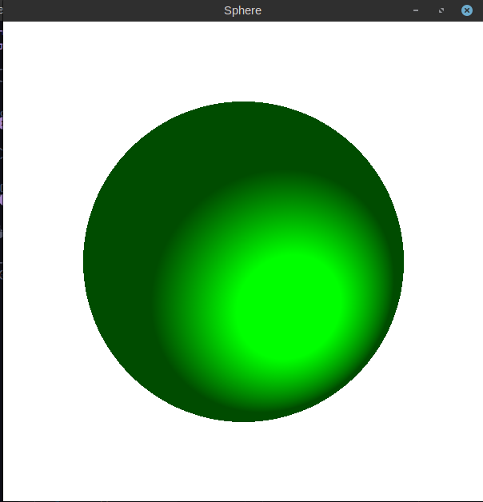

# SphereRendering

Rendering sphere on C++ using SFML

## Installation

```bash
sudo apt install clang
sudo apt-get install libsfml-dev
git clone https://github.com/khmelnitskiianton/SphereRendering
cd SphereRendering
make compile
./sphere
```
## Using

Run `./sphere <width> <height>` to set custom size of window



You have classes of `GObjects::Sphere`,`GObjects::Light` to set your sphere with different lightning

Also you can change it's position by `WASD` keys.